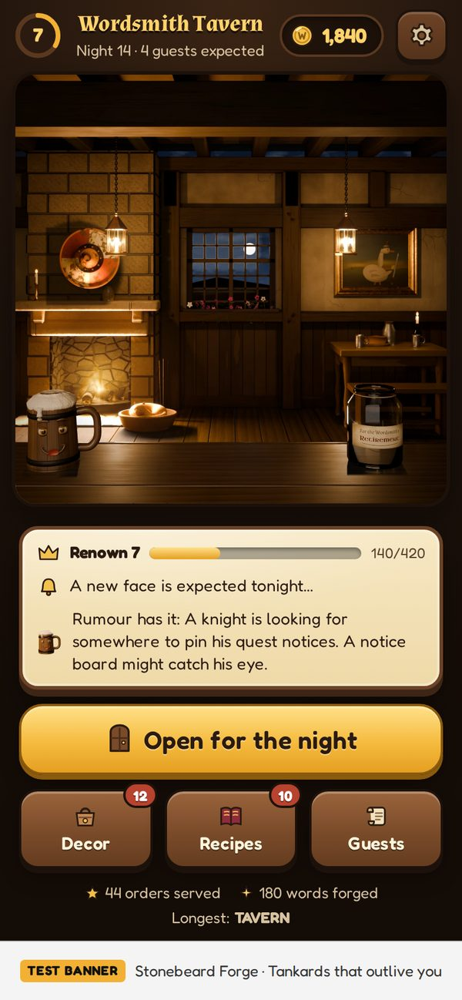
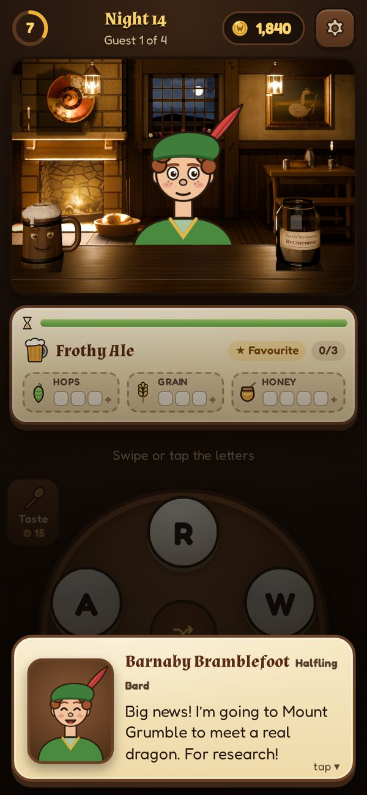
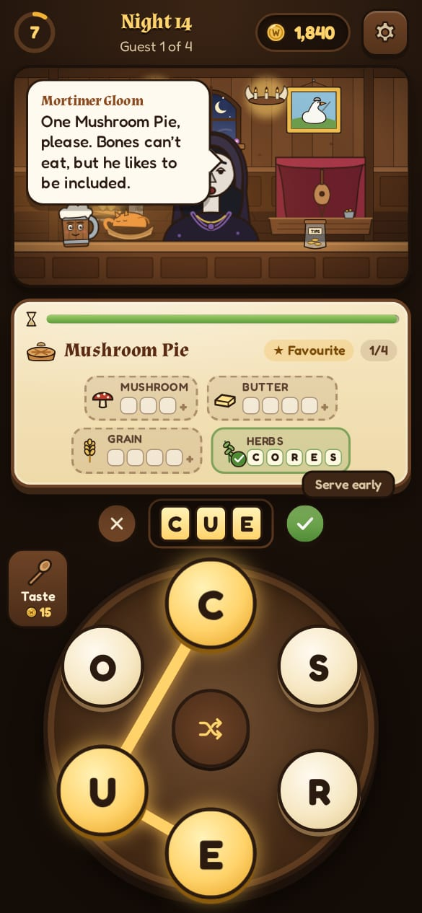
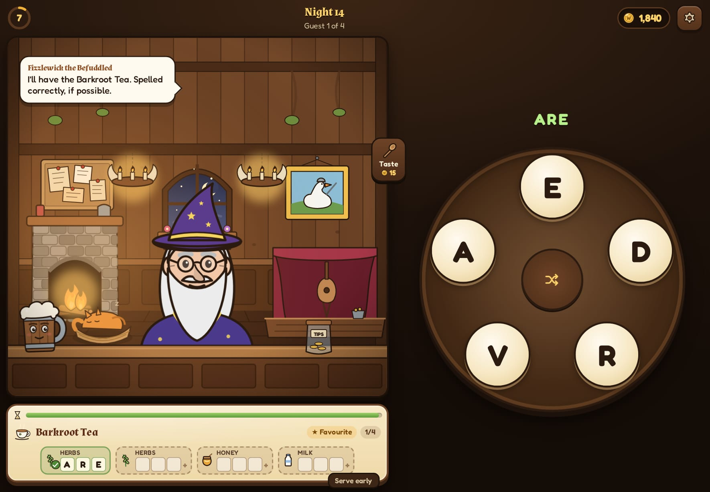

# Wordsmith Tavern

A cosy fantasy word game for phones and tablets. You've inherited a tavern in Quillhaven, where
cooking is word magic: guests hand you a set of letters, you forge words from them, and every word
becomes an ingredient in their order. Serve well and you earn coins, new recipes, furniture for
the tavern, and a growing cast of regulars, each with a ridiculous story that unfolds over many
nights.

<p align="center">
  
  
  
</p>
<p align="center">
  
</p>

## What's in the game

- **Forge wheel.** Swipe across letters (or tap them and press ✓) to make words. Each order is a
  recipe with ingredient slots: "any word of 4+ letters", or the ✨ secret ingredient that needs
  every letter. Extra words go in the tip jar.
- **Guests and patience.** Faster service means bigger tips and better reviews. Nobody ever storms
  out, and Relaxed mode switches the timer off entirely.
- **Eleven story guests**, each with a five-chapter tale told across nights: a bard with no rhymes,
  a smith forging the perfect tankard, a wizard who can't spell, a knight chasing a smudged quest
  scroll, a goblin whose fake dragon egg turns out to be real, and more. Finishing a tale leaves a
  keepsake in your tavern. Eleven kinds of townsfolk fill the gaps.
- **Barley**, the enchanted, sarcastic tankard who runs the tutorial and heckles your spelling.
- **Progression.** 18 recipes (bigger letter sets pay more), 37 furniture pieces with bonuses
  (tips, patience, renown, cheaper hints), renown levels, and furniture that attracts new guests.
- **Built for touch.** Portrait phones, portrait tablets and landscape tablets each get their own
  layout, with safe-area support, haptics, and synthesised sound and music.
- **Ad-supported, politely.** Rewarded ads are always optional (double the night's takings, a free
  hint, calm a grumpy guest, double the daily gift). Interstitials only appear between nights, never
  during your first nights, and never right after you chose to watch an ad. Banners stay on menu
  screens, away from the letter wheel. See [docs/MONETIZATION.md](docs/MONETIZATION.md).

The tavern, its furniture and Barley are path-traced 3D renders built entirely in code (Blender's
Python module, procedural materials; see [art/README.md](art/README.md)). Icons and the interface
are SVG, and all audio is synthesised at runtime, so there are no image, model or sound files to
license.

## Quick start

Requires Node 22+.

```bash
npm install
npm run dev          # http://localhost:5173
```

In the browser you get pretend in-world ads so every ad flow can be tried. `#gallery` on the dev
server shows every portrait, icon and furniture piece.

On a desktop you can also type: letters to pick tiles, Enter to serve, Backspace to undo, Space to
shuffle.

## Phones and tablets

The web game is wrapped with [Capacitor](https://capacitorjs.com) into native Android and iOS
projects (`android/`, `ios/`), with Google's test AdMob ids already wired in.

```bash
npm run android      # build, sync, open Android Studio
npm run ios          # build, sync, open Xcode (macOS)
```

[docs/RELEASE.md](docs/RELEASE.md) walks through AdMob setup, signing, store listings and the
pre-launch checklist.

## Project layout

```
src/
  game/        Pure game logic: dictionary, puzzle generator, orders, economy, progression,
               nights and stories, saves, shop. No DOM; fully unit-tested.
  content/     Recipes, furniture, guests and their stories, townsfolk, Barley's lines.
  app/         Signals-based state, the night/service flow, boot and actions.
  ui/          Preact screens, the letter wheel, overlays, SVG icons, and the rendered tavern
               layers (ui/art/renders/).
  services/    AdMob and pretend ads, audio synthesis, haptics, storage, platform hooks.
  config/      Ad unit configuration (read from env variables) and app version.
public/data/   Generated word lists (see scripts/build-dictionary.mjs).
scripts/       Dictionary builder and app icon/splash renderer.
tests/         Vitest unit tests.   e2e/  Playwright tests (phone and tablet).
android/ ios/  Capacitor native projects.
docs/          Design, monetization and release guides.
art/           The 3D tavern: Blender scripts that render the room, furniture and Barley.
```

## Scripts

| Command              | What it does                                        |
| -------------------- | --------------------------------------------------- |
| `npm run dev`        | Dev server with hot reload                          |
| `npm run build`      | Type-check and build to `dist/`                     |
| `npm test`           | Unit tests (logic, content integrity, ad pacing)    |
| `npm run test:e2e`   | Plays the real build on phone and tablet viewports  |
| `npm run typecheck`  | TypeScript only                                     |
| `npm run dictionary` | Regenerate the word lists from SCOWL                |
| `npm run cap:sync`   | Build and copy the web app into the native projects |

To regenerate the app icon and splash screens after changing the art, run the dev server, then
`node scripts/render-app-art.mjs` and `npx @capacitor/assets generate --ios --android`.

## Words

Word lists come from [SCOWL](http://wordlist.aspell.net/) in three tiers: the most familiar words
(used for puzzle roots and hints), further familiar words (used to prove every order is solvable),
and rarer words and regional spellings that are accepted but never suggested. A curated filter
blocks slurs and explicit words outright and keeps mild or gloomy words out of hints and puzzle
roots. The filter list is stored ROT13-encoded in `scripts/word-filter.json`.

## Credits and licences

- Word lists: SCOWL © Kevin Atkinson and contributors ([licence](licenses/SCOWL-Copyright.txt)).
- Fonts: Fredoka, Almendra and Uncial Antiqua under the SIL Open Font License
  ([licenses/](licenses/)).
- Built with Preact, Vite and Capacitor; ads via `@capacitor-community/admob`.

See [docs/GAME_DESIGN.md](docs/GAME_DESIGN.md) for the full design: rules, economy numbers,
unlocks and every guest's story.
